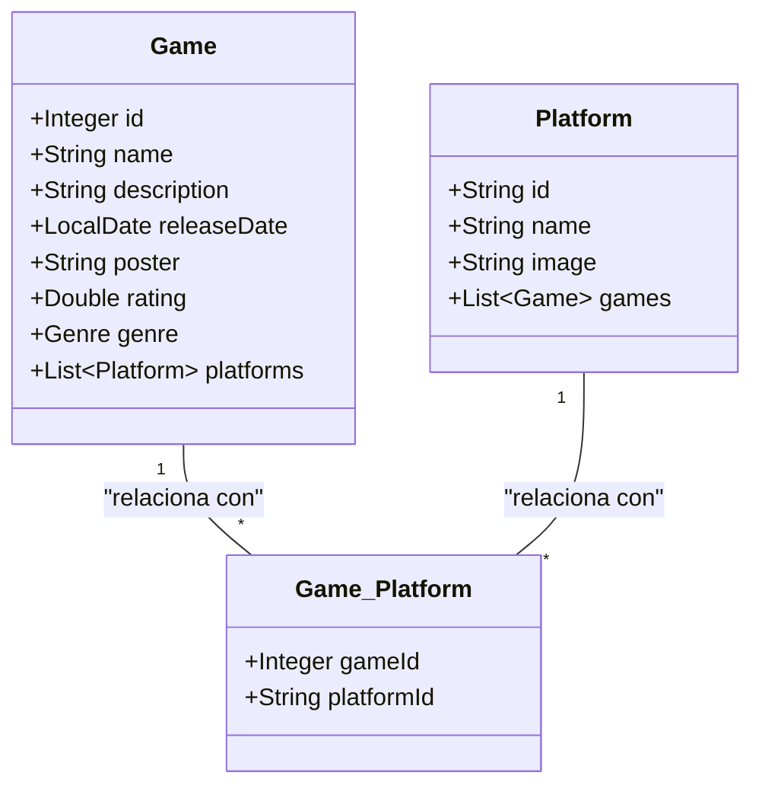

# PlayHunt Game Manager

¡Bienvenido/a a PlayHunt Game Manager! Este es un proyecto desarrollado en Java con Spring Boot que permite explorar y buscar información sobre videojuegos mediante la API de RAWG. Este proyecto obtiene datos detallados de videojuegos y traduce automáticamente las descripciones al español mediante la API de DeepTranslate.

## En PlayHunt Game Manager:

- Utilizamos Jackson Databind para integrar con la API de RAWG, extrayendo información de videojuegos en inglés.
- Luego, empleamos la API de DeepTranslate para traducir automáticamente la descripción de los juegos a español, facilitando la comprensión de los datos.
- Gracias a JPA, almacenamos la información traducida y manipulada en una base de datos de PostgreSQL, donde los datos se guardan en registros listos para consultas posteriores.

## Funcionalidades

PlayHunt Game Manager te ofrece varias funcionalidades para explorar y descubrir videojuegos:

1. **Búsqueda de Videojuegos**: Realiza búsquedas de videojuegos específicos, obteniendo información detallada, incluyendo descripción, calificación y plataforma.
2. **Filtrado por Plataforma o Género**: Filtra los videojuegos almacenados por plataforma o género para encontrar títulos de acuerdo a tus preferencias.
3. **Top 10 Videojuegos**: Consulta el top 10 de videojuegos mejor valorados, ideal para descubrir los más populares.

## 🔧 Tecnologías Utilizadas

- **Lenguaje de programación**: Java ☕
- **Framework**: Spring Boot 🌱 - Facilita la creación y configuración de aplicaciones Java, incluyendo el desarrollo de APIs RESTful.
- **Administración de dependencias**: Maven 🛠️ - Gestiona las dependencias y simplifica la construcción del proyecto.
- **Jackson Databind**: Biblioteca para procesar JSON, utilizada para convertir los datos de la API RAWG en objetos Java.
- **API RAWG**: Provee información detallada sobre videojuegos, como descripciones, calificaciones y plataformas.
- **API DeepTranslate**: Traductor automático usado para convertir la descripción de los juegos del inglés al español.
- **JPA (Java Persistence API)**: Utilizada para mapear los objetos de Java a una base de datos y gestionar el almacenamiento de datos en PostgreSQL.
- **Base de Datos**: PostgreSQL 🐘 - Sistema de gestión de bases de datos relacional donde se almacenan los datos de los videojuegos.
- **IDE**: IntelliJ IDEA 💻 - Entorno de desarrollo integrado para la programación en Java.

## Requisitos

- **Java 8 o superior**: PlayHunt Game Manager está desarrollado en Java, por lo que necesitas tener el JDK instalado.
- **Spring Boot**: Framework utilizado para la estructura del proyecto y manejo de dependencias.
- **PostgreSQL**: Base de datos relacional donde se almacenan los datos de los videojuegos.
- **Conexión a internet**: La aplicación utiliza la API de RAWG para obtener datos de videojuegos y la API de DeepTranslate para traducir descripciones en tiempo real.

## 🚀 Cómo Empezar

1. Clona este repositorio: `git clone https://github.com/tu_usuario/playhunt-game-manager.git`
2. Configura las claves API para [RAWG](https://rawg.io/apidocs) y [DeepTranslate](https://rapidapi.com/deep-translate-api-deep-translate-api-default/api/deep-translate).
3. Ajusta los datos de conexión de PostgreSQL en `application.properties`.
4. Ejecuta el proyecto desde tu IDE o con el comando `mvn spring-boot:run`.

## 🏠 Estructura del Proyecto

PlayHunt Game Manager está organizado en cuatro paquetes principales y una clase raíz:

1. **Raíz**:
   - **PlayHuntApplication**: Clase principal que inicia la aplicación y administra el flujo de ejecución.

2. **main**: Contiene la clase principal `Main`, que gestiona el menú y todos los métodos para realizar las solicitudes.

3. **model**: 
   - **DataGame (record)**: Representa los detalles completos de un juego, obtenidos después de una solicitud detallada utilizando el `slug` de `DataGameSearch`.
   - **DataGameSearch (record)**: Maneja los datos básicos de búsqueda de un juego obtenidos de la API RAWG.
   - **DataPlatform (record)**: Estructura los datos de las plataformas disponibles, obtenidos de la API RAWG.
   - **DataTranslate (record)**: Representa los datos de la traducción de las descripciones de los juegos, obtenidos mediante la API DeepTranslate.
   - **Game (class)**: Clase JPA que representa un juego en la base de datos PostgreSQL.
   - **Platform (class)**: Clase JPA que representa una plataforma en la base de datos PostgreSQL.
   - **Genre (enum)**: Enum que define los géneros de cada juego para un mejor control en la aplicación.

4. **repository**:
   - **GameRepository (interfaz)**: Define las consultas JPQL para interactuar con la base de datos de juegos.
   - **PlatformRepository (interfaz)**: Define las consultas JPQL para interactuar con la base de datos de plataformas.

5. **service**:
   - **ApiConsumer (class)**: Realiza las conexiones y solicitudes a la API RAWG para obtener la información de videojuegos.
   - **ApiTranslate (class)**: Realiza las conexiones a la API DeepTranslate para traducir las descripciones de los juegos.
   - **DataConvert (class)**: Convierte los datos obtenidos de la API en objetos `record`.
   - **IDataConvert (interfaz)**: Define el método `<T> T convert(String json, Class<T> clazz);`, que se utiliza para convertir una cadena JSON en una instancia de clase específica, facilitando la deserialización de datos JSON en objetos Java.

### Representacion de las clases para JPA

## ✒️ Autor

[ Kurt Angeles](https://github.com/kurttck)

## 😊 Contacto

* [LinkedIn](https://www.linkedin.com/in/kurt-angeles-segura/).
* [GitHub](https://github.com/kurttck).
